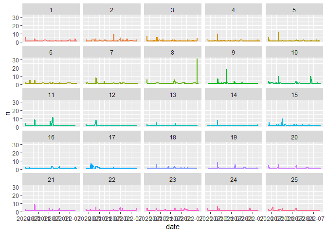

Topic modelling project:
================

### 0. Preparation: Load packages

``` r
defaultW <- getOption("warn") 
options(warn = -1) 
library(tidyverse)
library(tidytext)
library(rtweet)
library(wordcloud2)
library(topicmodels)
library(lubridate)
library(LDAvis)
library(scales)
library(servr)
options(warn = defaultW)
```

## Timeline comparison

### 1 API request

``` r
api_key <- "..."
api_secret_key <- "..."
access_token <- "..."
access_token_secret <- "..."

token <- create_token(app = "UnibgTwitter1082586", consumer_key = api_key, 
                      consumer_secret = api_secret_key, access_token = access_token, 
                      access_secret = access_token_secret, set_renv = FALSE)
```

#### 1.a Get the timelines

``` r
timeline <- get_timeline(c("745273", "8161232"),
    n = Inf, token = token)
```

### 2. Comparison

``` r
timeline %>%
    group_by(screen_name) %>%
    ts_plot(by = "month") + ggplot2::labs(title = "Tweets by business men",
    subtitle = "Naval Ravikant vs Richard Branson") + scale_colour_manual(values = c("steelblue",
    "skyblue")) + theme_bw()
```

<!-- -->

#### 2.a Word usage comparison

``` r
timeline_f <- timeline %>%
    filter(created_at >= as.Date("2020-04-21"))

text <- timeline_f %>%
    select(status_id, text, screen_name)

tidy_tweets <- text %>%
    unnest_tweets(word, text) %>%
    anti_join(stop_words)
```

    ## Using `to_lower = TRUE` with `token = 'tweets'` may not preserve URLs.

    ## Joining, by = "word"

``` r
library(scales)


tidy_tweets %>%
    group_by(screen_name) %>%
    count(word, sort = T) %>%
    mutate(prop = n/sum(n)) %>%
    select(screen_name, word, prop) %>%
    pivot_wider(names_from = screen_name, values_from = prop) %>%
    arrange(naval, richardbranson) %>%
    ggplot(aes(naval, richardbranson)) + geom_jitter(alpha = 0.5,
    size = 2.5, width = 0.25, height = 0.25, colour = "steelblue") +
    geom_text(aes(label = word), check_overlap = T, vjust = 0) +
    scale_x_log10(labels = percent_format()) + scale_y_log10(labels = percent_format()) +
    geom_abline(color = "red") + theme_bw()
```

    ## Warning: Removed 11628 rows containing missing values (geom_point).

    ## Warning: Removed 11628 rows containing missing values (geom_text).

<!-- -->

#### 2.a Word usage comparison - with data cleaned

``` r
new_stop <- tibble(word = c("dont", "youre", "im", "ive", "isnt", "whats", "youre", "theyre", "theres", "thats", "arent", "cant", "couldnt", "didnt", "doesnt", "hadnt", "hasnt", "havent", "hed", "hes", "youll", "itll")) 
new_stop$lexicon <- "custom"
custom_stop <- bind_rows(stop_words, new_stop)

tidy_tweets <- text %>%
    unnest_tweets(word, text) %>%
    anti_join(custom_stop)
```

    ## Using `to_lower = TRUE` with `token = 'tweets'` may not preserve URLs.

    ## Joining, by = "word"

``` r
tidy_tweets <- tidy_tweets %>% filter(!str_detect(word,"[^a-z A-Z 0-9]"))
tidy_tweets <- tidy_tweets %>% filter(!str_detect(word, "[:digit:]"))
tidy_tweets <- tidy_tweets %>% filter(!str_detect(word, "^@.*"))
tidy_tweets <- tidy_tweets %>% filter(!str_detect(word, "^https.*"))


tidy_tweets %>%
    group_by(screen_name) %>%
    count(word, sort = T) %>%
    mutate(prop = n/sum(n)) %>%
    select(screen_name, word, prop) %>%
    pivot_wider(names_from = screen_name, values_from = prop) %>%
    arrange(naval, richardbranson) %>%
    ggplot(aes(naval, richardbranson)) + geom_jitter(alpha = 0.5,
    size = 2.5, width = 0.25, height = 0.25, colour = "steelblue") +
    geom_text(aes(label = word), check_overlap = T, vjust = 0) +
    scale_x_log10(labels = percent_format()) + scale_y_log10(labels = percent_format()) +
    geom_abline(color = "red") + theme_bw()
```

    ## Warning: Removed 6273 rows containing missing values (geom_point).

    ## Warning: Removed 6273 rows containing missing values (geom_text).

<!-- -->

## Naval tweets

### 1 Overview

#### 1.a Extracting

``` r
naval_tweets <- timeline %>% filter(screen_name == "naval")
```

#### 1.b how many retweets?

``` r
naval_tweets %>% filter(is_retweet == TRUE) %>% count()
```

    ## # A tibble: 1 x 1
    ##       n
    ##   <int>
    ## 1   181

#### 1.c how many quotes?

``` r
naval_tweets %>% filter(is_quote == TRUE) %>% count()
```

    ## # A tibble: 1 x 1
    ##       n
    ##   <int>
    ## 1   229

#### 1.d how many replies?

``` r
naval_tweets %>% filter(!is.na(reply_to_user_id)) %>% count()
```

    ## # A tibble: 1 x 1
    ##       n
    ##   <int>
    ## 1  2288

``` r
naval_tweets %>% filter(!is.na(reply_to_screen_name)) %>% count() #double check
```

    ## # A tibble: 1 x 1
    ##       n
    ##   <int>
    ## 1  2288

#### 1.e max and min date

``` r
naval_tweets_desc <- naval_tweets %>% arrange(desc(created_at))
str_extract(naval_tweets_desc$created_at[1], "[:digit:]*-[:digit:]*-[:digit:]*") #Max (most recent tweet)
```

    ## [1] "2022-11-05"

``` r
naval_tweets_asc <- naval_tweets %>% arrange(created_at)
str_extract(naval_tweets_asc$created_at[1], "[:digit:]*-[:digit:]*-[:digit:]*") #Min (less recent tweet)
```

    ## [1] "2020-05-16"

### 2. Naval tweets - Topic modelling

#### 2.a Extracting

``` r
naval_tweets <- naval_tweets %>%
    mutate(id = 1:nrow(naval_tweets))

text <- naval_tweets %>%
    select(text, id)
text
```

    ## # A tibble: 3,248 x 2
    ##    text                                                                       id
    ##    <chr>                                                                   <int>
    ##  1 "A rational person can find peace by cultivating indifference to thing~     1
    ##  2 "@Jayhassett It’s an IQ test for followers."                                2
    ##  3 "If @elonmusk manages to liberate Twitter, efforts to control free spe~     3
    ##  4 "Good product design requires an obsessed artist - it’s not a part-tim~     4
    ##  5 "@NolanOBrien Good thread. \U0001f44c"                                      5
    ##  6 "@DeoSaurabh There was no deck. It ran on SMS and I begged my way in."      6
    ##  7 "Democratizing verification levels the playing field, exposes bots, an~     7
    ##  8 "People trying to kill Twitter are about to discover how powerful netw~     8
    ##  9 "Charging for the blue check moves it from a status symbol to a utilit~     9
    ## 10 "@Tinfact1 Even the childless need a religion."                            10
    ## # ... with 3,238 more rows

#### 2.b Cleaning

``` r
tidy_text <- text %>%
    unnest_tweets(word, text) %>%
    anti_join(custom_stop) %>%
    count(id, word)
```

    ## Using `to_lower = TRUE` with `token = 'tweets'` may not preserve URLs.

    ## Joining, by = "word"

``` r
tidy_text <- tidy_text %>% filter(!str_detect(word,"[^a-z A-Z 0-9]"))
tidy_text <- tidy_text %>% filter(!str_detect(word, "[:digit:]"))
tidy_text <- tidy_text %>% filter(!str_detect(word, "^@.*"))
tidy_text <- tidy_text %>% filter(!str_detect(word, "^https.*"))
```

#### 2.c Dtm

``` r
dtm <- tidy_text %>%
    cast_dtm(id, word, n)
dtm
```

    ## <<DocumentTermMatrix (documents: 2761, terms: 5506)>>
    ## Non-/sparse entries: 14762/15187304
    ## Sparsity           : 100%
    ## Maximal term length: 24
    ## Weighting          : term frequency (tf)

#### 2.d Testing

``` r
set.seed(123456)
train <- sample(rownames(dtm), nrow(dtm) * 0.75)
dtm_train <- dtm[rownames(dtm) %in% train, ]
dtm_test <- dtm[!rownames(dtm) %in% train, ]

topic <- data.frame(k = c(5, 15, 25, 30, 35), perplexity = NA)

for (i in 1:nrow(topic)) {
    print(topic$k[i])
    m = LDA(dtm_train, method = "Gibbs", k = topic$k[i], control = list(alpha = 0.01,
        seed = 123456))
    topic$perplexity[i] = perplexity(m, dtm_test)
}
```

    ## [1] 5
    ## [1] 15
    ## [1] 25
    ## [1] 30
    ## [1] 35

``` r
ggplot(topic, aes(x = k, y = perplexity)) + geom_line(col = "steelblue") +
    theme_bw()
```

<!-- -->

Different range

``` r
topic <- data.frame(k = c(25, 30, 35, 40, 45), perplexity = NA)

for (i in 1:nrow(topic)) {
    print(topic$k[i])
    m = LDA(dtm_train, method = "Gibbs", k = topic$k[i], control = list(alpha = 0.01,
        seed = 123456))
    topic$perplexity[i] = perplexity(m, dtm_test)
}
```

    ## [1] 25
    ## [1] 30
    ## [1] 35
    ## [1] 40
    ## [1] 45

``` r
ggplot(topic, aes(x = k, y = perplexity)) + geom_line(col = "steelblue") +
    theme_bw()
```

<!-- -->

``` r
topic <- data.frame(k = c(21, 22, 23, 24, 25), perplexity = NA)

for (i in 1:nrow(topic)) {
    print(topic$k[i])
    m = LDA(dtm_train, method = "Gibbs", k = topic$k[i], control = list(alpha = 0.01,
        seed = 123456))
    topic$perplexity[i] = perplexity(m, dtm_test)
}
```

    ## [1] 21
    ## [1] 22
    ## [1] 23
    ## [1] 24
    ## [1] 25

``` r
ggplot(topic, aes(x = k, y = perplexity)) + geom_line(col = "steelblue") +
    theme_bw()
```

<!-- -->

#### 2.e Running the model

``` r
m <- LDA(dtm, method = "Gibbs", k = 25, control = list(alpha = 0.01,
    seed = 123456))
```

``` r
terms(m, 7)
```

    ##      Topic 1     Topic 2      Topic 3        Topic 4     Topic 5     
    ## [1,] "status"    "stop"       "people"       "world"     "people"    
    ## [2,] "game"      "free"       "clubhouse"    "people"    "happy"     
    ## [3,] "signaling" "censorship" "live"         "real"      "incentives"
    ## [4,] "virtue"    "feel"       "win"          "inflation" "wealthy"   
    ## [5,] "wealth"    "speech"     "conversation" "twitter"   "youtube"   
    ## [6,] "games"     "live"       "world"        "asset"     "live"      
    ## [7,] "tweets"    "risk"       "follow"       "tech"      "smart"     
    ##      Topic 6     Topic 7    Topic 8   Topic 9   Topic 10  Topic 11   
    ## [1,] "company"   "naval"    "nuclear" "social"  "mind"    "media"    
    ## [2,] "safe"      "video"    "ukraine" "nfts"    "life"    "company"  
    ## [3,] "product"   "ravikant" "nukes"   "bitcoin" "people"  "software" 
    ## [4,] "build"     "life"     "russia"  "crypto"  "quality" "engineers"
    ## [5,] "team"      "time"     "war"     "token"   "reason"  "startups" 
    ## [6,] "products"  "music"    "peace"   "exit"    "love"    "wont"     
    ## [7,] "marketing" "escape"   "nato"    "media"   "measure" "run"      
    ##      Topic 12     Topic 13     Topic 14    Topic 15     Topic 16  
    ## [1,] "read"       "truth"      "beginning" "monopolies" "tweet"   
    ## [2,] "books"      "society"    "infinity"  "network"    "original"
    ## [3,] "love"       "question"   "science"   "monopoly"   "quote"   
    ## [4,] "reading"    "class"      "read"      "political"  "ill"     
    ## [5,] "understand" "jobs"       "book"      "freedom"    "quoting" 
    ## [6,] "write"      "technology" "reality"   "replace"    "words"   
    ## [7,] "math"       "search"     "listen"    "natural"    "youd"    
    ##      Topic 17      Topic 18 Topic 19    Topic 20   Topic 21    Topic 22   
    ## [1,] "fund"        "true"   "money"     "term"     "hard"      "time"     
    ## [2,] "rolling"     "power"  "knowledge" "modern"   "physics"   "wisdom"   
    ## [3,] "funds"       "news"   "wealth"    "wars"     "wrong"     "people"   
    ## [4,] "lps"         "free"   "mental"    "false"    "theory"    "buy"      
    ## [5,] "traditional" "system" "hard"      "day"      "science"   "happiness"
    ## [6,] "time"        "fake"   "land"      "culture"  "learn"     "twitter"  
    ## [7,] "venture"     "human"  "pretty"    "thinking" "evolution" "money"    
    ##      Topic 23   Topic 24   Topic 25       
    ## [1,] "blocked"  "free"     "government"   
    ## [2,] "block"    "truth"    "decentralized"
    ## [3,] "people"   "markets"  "money"        
    ## [4,] "twitter"  "feel"     "data"         
    ## [5,] "outrage"  "people"   "apps"         
    ## [6,] "spam"     "feedback" "platform"     
    ## [7,] "personal" "game"     "followers"

#### 2.g Per-topic per-word probabilities

``` r
tidy_topics <- tidy(m, matrix = "beta") 

tidy_topics
```

    ## # A tibble: 137,650 x 3
    ##    topic term         beta
    ##    <int> <chr>       <dbl>
    ##  1     1 control 0.00100  
    ##  2     2 control 0.000943 
    ##  3     3 control 0.0000871
    ##  4     4 control 0.00324  
    ##  5     5 control 0.0000847
    ##  6     6 control 0.0000978
    ##  7     7 control 0.0000973
    ##  8     8 control 0.0000734
    ##  9     9 control 0.0000690
    ## 10    10 control 0.00337  
    ## # ... with 137,640 more rows

#### 2.h Results plot

``` r
top_terms <- tidy_topics %>%
    group_by(topic) %>%
    slice_max(beta, n = 7, with_ties = F) %>%
    ungroup() %>%
    arrange(topic, -beta)

top_terms %>%
    mutate(term = reorder_within(term, beta, topic)) %>%
    ggplot(aes(beta, term)) + geom_col(show.legend = F, fill = "skyblue") +
    facet_wrap(~topic, scales = "free") + scale_y_reordered() +
    theme_bw()
```

<!-- -->

#### 2.i Word assignment to each topic

``` r
word_ass <- augment(m, dtm)
word_ass %>% arrange(desc(count))
```

    ## # A tibble: 14,762 x 4
    ##    document term    count .topic
    ##    <chr>    <chr>   <dbl>  <dbl>
    ##  1 2830     replace     6     15
    ##  2 1065     exit        6      9
    ##  3 1941     exit        6      9
    ##  4 2423     measure     5     10
    ##  5 2858     term        5     20
    ##  6 291      gt          5     11
    ##  7 2997     drone       5     23
    ##  8 1590     token       5      9
    ##  9 2590     fund        5     17
    ## 10 1716     wealth      4     19
    ## # ... with 14,752 more rows

#### 2.l Topic proportion in documents

``` r
tidy_gamma <- tidy(m, matrix = "gamma")

#we choose two random topics and sort the gamma values to verify which document has the higher prevalence of the selected topic
tidy_gamma %>% filter(topic == 1) %>% arrange(desc(gamma)) 
```

    ## # A tibble: 2,761 x 3
    ##    document topic gamma
    ##    <chr>    <int> <dbl>
    ##  1 2829         1 0.991
    ##  2 1929         1 0.986
    ##  3 2043         1 0.979
    ##  4 2575         1 0.979
    ##  5 654          1 0.974
    ##  6 761          1 0.974
    ##  7 2532         1 0.974
    ##  8 2794         1 0.974
    ##  9 297          1 0.971
    ## 10 2822         1 0.971
    ## # ... with 2,751 more rows

``` r
tidy_gamma %>% filter(topic == 2) %>% arrange(desc(gamma))
```

    ## # A tibble: 2,761 x 3
    ##    document topic gamma
    ##    <chr>    <int> <dbl>
    ##  1 783          2 0.989
    ##  2 1797         2 0.987
    ##  3 1968         2 0.987
    ##  4 776          2 0.982
    ##  5 1095         2 0.980
    ##  6 1558         2 0.980
    ##  7 1560         2 0.980
    ##  8 1231         2 0.977
    ##  9 410          2 0.974
    ## 10 1221         2 0.974
    ## # ... with 2,751 more rows

``` r
tidy_gamma %>% filter(topic == 15) %>% arrange(desc(gamma))
```

    ## # A tibble: 2,761 x 3
    ##    document topic gamma
    ##    <chr>    <int> <dbl>
    ##  1 2830        15 0.990
    ##  2 1306        15 0.989
    ##  3 1921        15 0.988
    ##  4 466         15 0.986
    ##  5 2757        15 0.985
    ##  6 1917        15 0.983
    ##  7 2354        15 0.983
    ##  8 3           15 0.982
    ##  9 403         15 0.982
    ## 10 2380        15 0.982
    ## # ... with 2,751 more rows

We check also the content of the two tweets with the highest gamma

``` r
naval_tweets %>% filter(id == 167) %>% select(text)
```

    ## # A tibble: 1 x 1
    ##   text                    
    ##   <chr>                   
    ## 1 "@kristinm90 \U0001f44b"

``` r
naval_tweets %>% filter(id == 253) %>% select(text)
```

    ## # A tibble: 1 x 1
    ##   text                                                                          
    ##   <chr>                                                                         
    ## 1 The struggle between collectivists and the individual is as old as humanity i~

``` r
naval_tweets %>% filter(id == 617) %>% select(text)
```

    ## # A tibble: 1 x 1
    ##   text              
    ##   <chr>             
    ## 1 @julesterpak Kids.

#### 2.m Checking how many documents contain a certain topic

``` r
doc_class <- tidy_gamma %>%
    group_by(document) %>%
    slice_max(gamma) %>%
    ungroup() %>%
    arrange(as.numeric(document))

doc_class <- doc_class %>%
    anti_join(doc_class %>%
        select(document) %>%
        mutate(dup = duplicated(document)) %>%
        filter(dup == "TRUE"))
```

    ## Joining, by = "document"

``` r
doc_ass <- naval_tweets %>%
    mutate(id = as.character(id)) %>%
    rename(document = "id") %>%
    inner_join(doc_class)
```

    ## Joining, by = "document"

``` r
doc_ass
```

    ## # A tibble: 2,618 x 93
    ##    user_id status_id           created_at          screen_name text       source
    ##    <chr>   <chr>               <dttm>              <chr>       <chr>      <chr> 
    ##  1 745273  1588950417530290178 2022-11-05 17:44:35 naval       "A ration~ Twitt~
    ##  2 745273  1588944535073468417 2022-11-05 17:21:12 naval       "@Jayhass~ Twitt~
    ##  3 745273  1588943799400927232 2022-11-05 17:18:17 naval       "If @elon~ Twitt~
    ##  4 745273  1588943426229522433 2022-11-05 17:16:48 naval       "Good pro~ Twitt~
    ##  5 745273  1588943145714450435 2022-11-05 17:15:41 naval       "@NolanOB~ Twitt~
    ##  6 745273  1588942383068368897 2022-11-05 17:12:39 naval       "@DeoSaur~ Twitt~
    ##  7 745273  1588936833060450304 2022-11-05 16:50:36 naval       "Democrat~ Twitt~
    ##  8 745273  1588806261583515648 2022-11-05 08:11:46 naval       "People t~ Twitt~
    ##  9 745273  1587523978456748033 2022-11-01 19:16:25 naval       "Charging~ Twitt~
    ## 10 745273  1587289881868238848 2022-11-01 03:46:12 naval       "@Tinfact~ Twitt~
    ## # ... with 2,608 more rows, and 87 more variables: display_text_width <dbl>,
    ## #   reply_to_status_id <chr>, reply_to_user_id <chr>,
    ## #   reply_to_screen_name <chr>, is_quote <lgl>, is_retweet <lgl>,
    ## #   favorite_count <int>, retweet_count <int>, quote_count <int>,
    ## #   reply_count <int>, hashtags <list>, symbols <list>, urls_url <list>,
    ## #   urls_t.co <list>, urls_expanded_url <list>, media_url <list>,
    ## #   media_t.co <list>, media_expanded_url <list>, media_type <list>, ...

``` r
doc_ass %>%
  count(topic) %>% ggplot(aes(x = reorder(topic,n), y = n, fill = reorder(factor(topic), n)))+
  geom_bar(stat = 'identity') +
  theme(legend.position = "null") +
  coord_flip()
```

<!-- -->

#### 2.n Topics variation over time

``` r
doc_ass %>%
    mutate(year = year(created_at)) %>%
    group_by(year) %>%
    count(topic)
```

    ## # A tibble: 75 x 3
    ## # Groups:   year [3]
    ##     year topic     n
    ##    <dbl> <int> <int>
    ##  1  2020     1    32
    ##  2  2020     2    33
    ##  3  2020     3    42
    ##  4  2020     4    37
    ##  5  2020     5    56
    ##  6  2020     6    36
    ##  7  2020     7    35
    ##  8  2020     8    17
    ##  9  2020     9    27
    ## 10  2020    10    56
    ## # ... with 65 more rows

``` r
t <- doc_ass %>% 
  mutate(date = as.Date(created_at)) %>% 
  group_by(date) %>% count(topic)  

require(reshape2)
```

    ## Loading required package: reshape2

    ## Warning: package 'reshape2' was built under R version 4.1.2

    ## 
    ## Attaching package: 'reshape2'

    ## The following object is masked from 'package:tidyr':
    ## 
    ##     smiths

``` r
t %>% 
    ggplot(aes(date, y = n, color = factor(topic))) +
    geom_line(stat="identity", size = 1) +
    theme(legend.position = "none") +
    facet_wrap(~topic)
```

<!-- -->

``` r
t %>% filter(topic == 21) %>% arrange(desc(n))
```

    ## # A tibble: 61 x 3
    ## # Groups:   date [61]
    ##    date       topic     n
    ##    <date>     <int> <int>
    ##  1 2020-11-01    21     9
    ##  2 2021-07-08    21     5
    ##  3 2021-12-29    21     4
    ##  4 2020-05-21    21     3
    ##  5 2020-05-29    21     3
    ##  6 2020-11-02    21     3
    ##  7 2021-09-06    21     3
    ##  8 2021-12-30    21     3
    ##  9 2020-05-18    21     2
    ## 10 2020-05-20    21     2
    ## # ... with 51 more rows

``` r
t %>% filter(topic == 22) %>% arrange(desc(n))
```

    ## # A tibble: 85 x 3
    ## # Groups:   date [85]
    ##    date       topic     n
    ##    <date>     <int> <int>
    ##  1 2020-11-01    22     6
    ##  2 2021-12-30    22     6
    ##  3 2022-02-08    22     4
    ##  4 2022-10-02    22     4
    ##  5 2020-05-17    22     3
    ##  6 2020-07-26    22     3
    ##  7 2020-12-30    22     3
    ##  8 2021-09-06    22     3
    ##  9 2021-12-31    22     3
    ## 10 2020-05-27    22     2
    ## # ... with 75 more rows

#### 2.o Interactive view for topics

``` r
#does not work in markdown, needs to be executed in the console.
dtm <- dtm[slam::row_sums(dtm) > 0, ]
phi <- as.matrix(posterior(m)$terms)
theta <- as.matrix(posterior(m)$topics)
vocab <- colnames(phi)
doc.length = slam::row_sums(dtm)
term.freq = slam::col_sums(dtm)[match(vocab, colnames(dtm))]

json <- createJSON(phi = phi, theta = theta, vocab = vocab, doc.length = doc.length,
    term.frequency = term.freq)
serVis(json)
```
